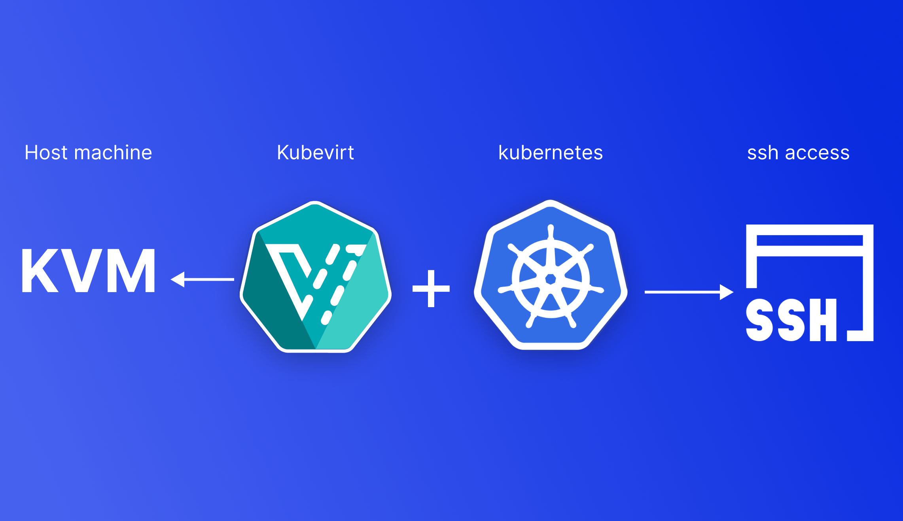
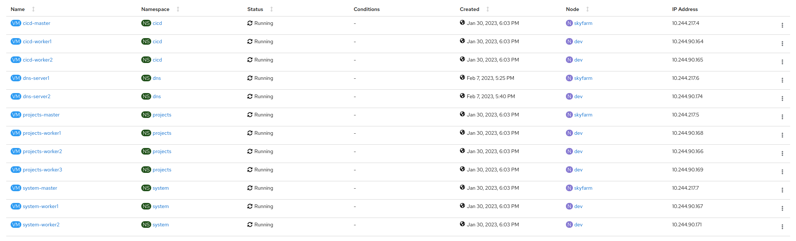
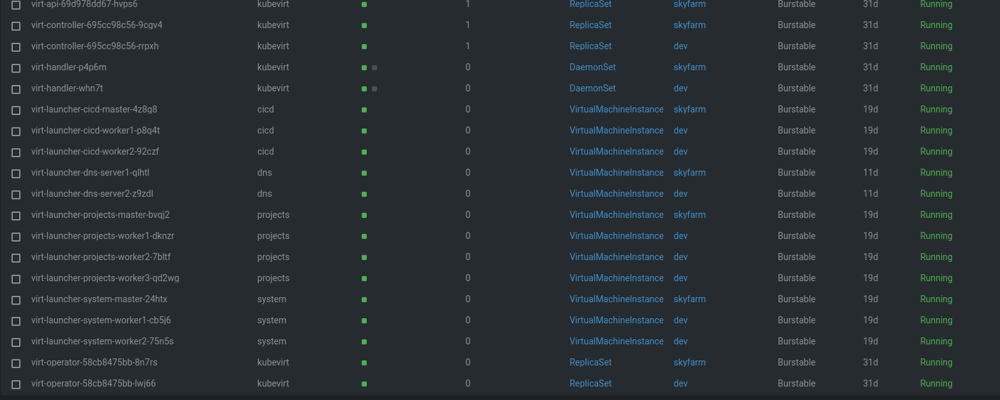
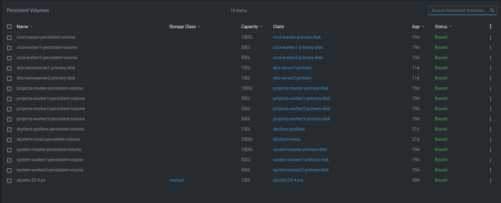
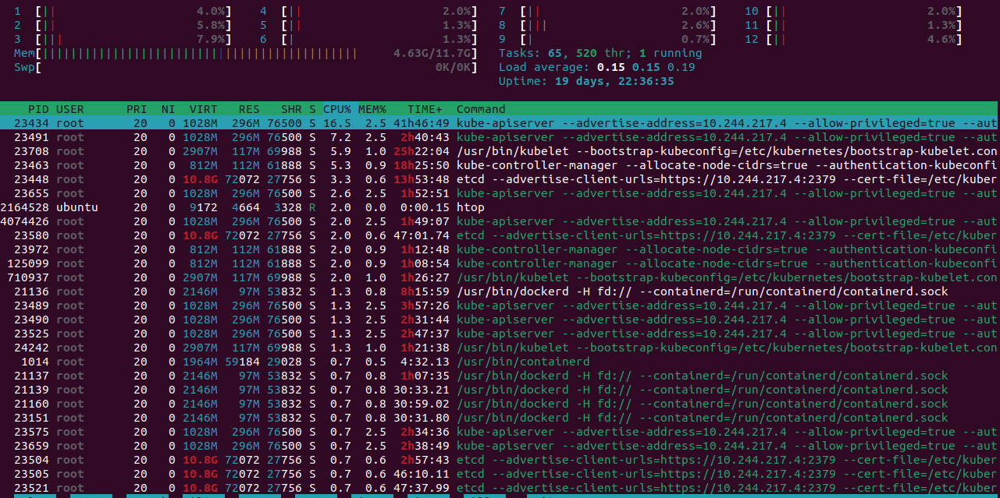

# k8s-virtualization

## Overview

k8s-virtualization as an automation source code can automate the deployment of k8s-virtualization backend and infrastructure. Universe consists of several sub-systems that deploy separate parts of the infrastructure separately. The underlying infrastructure has been automated by Ansible while the cluster-level automation has been conducted with Hashicorp Terraform. With k8s-virtualization we deploy several Virtual machines at once and fully automated with KVM in the backend and Kubevirt on Kubernetes. In this document, we go through the capabilities of the source code, a list of features, basic concepts, and finally the full deployment roadmap and guidelines.

## Prerequisite

### Host Nodes

**Note:** For the purpose of this project you need at least 2 Nodes (one master and one worker)

Please before installation make sure that your CPU supports hardware virtualization via the `egrep` command

```bash
egrep -c '(vmx|svm)' /proc/cpuinfo
```

If the command returns a value of **0**, your processor it not capable of running KVM. on the other hand, any other number means you can proceed with the installation.

- **openssh-server**

Please make sure that you have installed and activated open-ssh on your host machine. Below you can find an installation guide. You need to activate open-ssh, generate a key, and copy the key to your host machine.

Step 1.

install openssh-server on all of your nodes.

```bash
sudo apt-get install openssh-server
```

step 2.

Enable the ssh service by typing

```bash
sudo systemctl enable ssh
## OR enable and start the ssh service immediately ##
sudo systemctl enable ssh --now
```

step 3.

Start the ssh service by typing

```bash
sudo systemctl start ssh
```

step 4.

Test it by login into the system using

```bash
ssh userName@Your-server-name-IP
ssh ec2-user@ec2-aws-ip-here
```

step 5. (On you local machine)

You need to generate a private-public key for your ssh access

```bash
ssh-keygen
## specify an appropriate address for your key files
## enter a pass phrase by your choice
```

step 6.

copy your public key to the ssh-server

```bash
ssh-copy-id -i {ssh key address}.pub user@host
## enter your password
```

step 7. (Inside your hose machine)

we need to disable the ssh password in our ssh-server for security issues

```bash
sudo nano/vim /etc/ssh/sshd_config
## Search for PasswordAuthentication and set the option 
## to no to disable PasswordAuthentication method and yes to enable.
```

step 8.

restart your ssh-server

```bash
sudo systemctl restart sshd
```

Congratulations! Now you have access to the server by ssh and key

```bash
ssh -i {ssh private key file path} user@address
```

- **Ansible**

step 1.

add repository to your local machine

```bash
sudo apt-add-repository ppa:ansible/ansible
```

step 2.

Next, refresh your system’s package index so that it is aware of the packages     available in the newly included PPA

```bash
sudo apt update
```

step 3.

install ansible with **apt**

```bash
sudo apt install ansible
```

step 4.

configure inventory file [hosts.ini](universe/configuration/hosts.ini)

```ini
[master]
{your master node address} ansible_sudo_pass='{your host sudo pass}'
# example 10.10.10.10

[node]
{your nodes addresses} ansible_sudo_pass='{your host sudo pass}'
# example 192.16.35.[10:11] you can specify your nodes with a range of ips

# group your cluster
[kube-cluster:children]
master
node
```

- Terraform

step 1.

install terraform

```bash
sudo apt-get update \
sudo apt-get install -y gnupg software-properties-common
```

step 2.

verify your installation

```bash
terraform -help
Usage: terraform [-version] [-help] <command> [args]

The available commands for execution are listed below.
The most common, useful commands are shown first, followed by
less common or more advanced commands. If you're just getting
started with Terraform, stick with the common commands. For the
other commands, please read the help and docs before usage.
##...
```

# Source code

```bash
git clone https://github.com/MoeidHeidari/universe-infra.git && cd universe-infra
```

# Run tests

```bash
cd configuration
ansible-playbook tests.yml
```

# Execution

## infrastructure preparation

```bash
cd configuration
ansible-playbook site.yml
```

## Deploy infrastructure on the main cluster

```bash
cd IaC/infrastructure
terraform init
terraform plan -o plan
terraform apply
```

## Create computing instances (VMS)

```bash
cd IaC/comuting
terraform init
terraform plan -o plan
terraform apply
```

# Project structure

```bash
├── code
├── infrastructure
├── LICENSE
├── projects
├── README.md
├── system
└── universe
    ├── configuration
    │   ├── ansible.cfg
    │   ├── group_vars
    │   │   └── all.yml
    │   ├── hosts.ini
    │   ├── roles
    │   │   ├── cni
    │   │   │   ├── defaults
    │   │   │   │   └── main.yml
    │   │   │   ├── tasks
    │   │   │   │   └── main.yml
    │   │   │   └── templates
    │   │   │       ├── calico.yml.j2
    │   │   │       ├── canal.yml.j2
    │   │   │       └── flannel.yml.j2
    │   │   ├── commons
    │   │   │   ├── os-checker
    │   │   │   │   ├── defaults
    │   │   │   │   │   └── main.yml
    │   │   │   │   └── tasks
    │   │   │   │       └── main.yml
    │   │   │   └── pre-install
    │   │   │       ├── meta
    │   │   │       │   └── main.yml
    │   │   │       ├── tasks
    │   │   │       │   ├── main.yml
    │   │   │       │   └── pkg.yml
    │   │   │       └── templates
    │   │   │           └── 20-extra-args.conf.j2
    │   │   ├── curl
    │   │   │   └── tasks
    │   │   │       ├── install.yml
    │   │   │       ├── main.yml
    │   │   │       └── prechecks.yml
    │   │   ├── docker
    │   │   │   ├── defaults
    │   │   │   │   └── main.yml
    │   │   │   ├── meta
    │   │   │   │   └── main.yml
    │   │   │   ├── tasks
    │   │   │   │   ├── install.yml
    │   │   │   │   ├── main.yml
    │   │   │   │   └── prechecks.yml
    │   │   │   └── templates
    │   │   │       ├── daemon.json.j2
    │   │   │       ├── docker.j2
    │   │   │       └── docker.service.j2
    │   │   ├── git
    │   │   │   ├── defaults
    │   │   │   └── tasks
    │   │   │       ├── install.yml
    │   │   │       ├── main.yml
    │   │   │       └── prechecks.yml
    │   │   ├── kubernetes
    │   │   │   ├── master
    │   │   │   │   ├── defaults
    │   │   │   │   │   └── main.yml
    │   │   │   │   ├── tasks
    │   │   │   │   │   ├── init.yml
    │   │   │   │   │   ├── install.yml
    │   │   │   │   │   ├── main.yml
    │   │   │   │   │   ├── prechecks.yml
    │   │   │   │   │   └── preflight.yml
    │   │   │   │   └── templates
    │   │   │   └── node
    │   │   ├── kubevirt
    │   │   │   ├── defaults
    │   │   │   ├── tasks
    │   │   │   │   ├── crds.yml
    │   │   │   │   ├── data-importer.yml
    │   │   │   │   ├── main.yml
    │   │   │   │   ├── okd.yml
    │   │   │   │   └── operators.yml
    │   │   │   └── templates
    │   │   │       └── okd.j2
    │   │   ├── pv
    │   │   │   ├── defaults
    │   │   │   └── tasks
    │   │   │       ├── directories.yml
    │   │   │       ├── main.yml
    │   │   │       └── precheks.yml
    │   │   └── tests
    │   │       └── tasks
    │   │           └── main.yml
    │   ├── site.yml
    │   └── tests.yml
    └── IaC
        └── universe
            ├── computing
            │   ├── main.tf
            │   ├── modules
            │   │   ├── container-vm
            │   │   │   ├── Dockerfile
            │   │   │   ├── main.tf
            │   │   │   └── variables.tf
            │   │   └── physical_vm
            │   │       ├── main.tf
            │   │       └── variables.tf
            │   ├── plan
            │   ├── template.yml
            │   ├── terraform.tfstate
            │   ├── terraform.tfstate.backup
            │   ├── variables.tf
            │   └── versions.tf
            └── infrastructure
                ├── grafana
                │   └── values.yml
                ├── harbor
                │   └── values.yml
                ├── influxdb
                │   └── values.yml
                ├── main.tf
                ├── minio-s3
                │   └── values.yml
                ├── plan
                ├── prometheus
                │   └── values.yml
                ├── terraform.tfstate
                ├── terraform.tfstate.backup
                ├── variables.tf
                └── versions.tf
```

# Configuration management

The configuration of this project has been written with Ansible. It starts from the most basic dependency installation to the cluster installation and preparation. The only thing which is required is to have your nodes up and running with a reliable ssh connection.
Below you can see the structure of our ansible project accordingly.

```bash
├── ansible.cfg
├── group_vars
│   └── all.yml
├── hosts.ini
├── roles
│   ├── cni
│   │   ├── defaults
│   │   │   └── main.yml
│   │   ├── tasks
│   │   │   └── main.yml
│   │   └── templates
│   │       ├── calico.yml.j2
│   │       ├── canal.yml.j2
│   │       └── flannel.yml.j2
│   ├── commons
│   │   ├── os-checker
│   │   │   ├── defaults
│   │   │   │   └── main.yml
│   │   │   └── tasks
│   │   │       └── main.yml
│   │   └── pre-install
│   │       ├── meta
│   │       │   └── main.yml
│   │       ├── tasks
│   │       │   ├── main.yml
│   │       │   └── pkg.yml
│   │       └── templates
│   │           └── 20-extra-args.conf.j2
│   ├── curl
│   │   └── tasks
│   │       ├── install.yml
│   │       ├── main.yml
│   │       └── prechecks.yml
│   ├── docker
│   │   ├── defaults
│   │   │   └── main.yml
│   │   ├── meta
│   │   │   └── main.yml
│   │   ├── tasks
│   │   │   ├── install.yml
│   │   │   ├── main.yml
│   │   │   └── prechecks.yml
│   │   └── templates
│   │       ├── daemon.json.j2
│   │       ├── docker.j2
│   │       └── docker.service.j2
│   ├── git
│   │   └── tasks
│   │       ├── install.yml
│   │       ├── main.yml
│   │       └── prechecks.yml
│   ├── kubernetes
│   │   └── master
│   │       ├── defaults
│   │       │   └── main.yml
│   │       └── tasks
│   │           ├── init.yml
│   │           ├── install.yml
│   │           ├── main.yml
│   │           ├── prechecks.yml
│   │           └── preflight.yml
│   ├── kubevirt
│   │   ├── tasks
│   │   │   ├── crds.yml
│   │   │   ├── data-importer.yml
│   │   │   ├── main.yml
│   │   │   ├── okd.yml
│   │   │   └── operators.yml
│   │   └── templates
│   │       └── okd.j2
│   ├── pv
│   │   └── tasks
│   │       ├── directories.yml
│   │       ├── main.yml
│   │       └── precheks.yml
│   └── tests
│       └── tasks
│           └── main.yml
├── site.yml
└── tests.yml
```

## Global variables description

| #   | var name            | type          | usage                                                                                               |
| --- | ------------------- | ------------- | --------------------------------------------------------------------------------------------------- |
| 1   | kube_version        | string        | version of the kubernetes to be installed                                                           |
| 2   | token               | string        | kubeadm custom token for join command generating                                                    |
| 3   | init_opts           | string        | feature gates to be installed                                                                       |
| 4   | kubeadm_opts        | string        | the list of kubernetes addons to be enabled                                                         |
| 5   | service_cidr        | string        | specifies the service network CIDR (IP range)                                                       |
| 6   | pod_network_cidr    | string        | specifies the pod network CIDR (IP rane)                                                            |
| 7   | network             | string        | name of the pod network controller to be installed(options: Calico, flannel and canal)              |
| 8   | network_interface   | string        | Your chosen network interface to be used . Default is your default network interface                |
| 9   | enable_dashboard    | boolean       | Checks if the kubernetes dashboard should be enabled or not                                         |
| 10  | insecure_registries | array string  | specifies the list of trusted insecure docker registries to be added to the docker daemon.json file |
| 11  | systemd_dir         | string (path) | root directory of the systemd                                                                       |
| 12  | systemd_env_dir     | string (path) | root directory of the sysconfig file                                                                |
| 13  | network_dir         | string (path) | root directory of the kubernetes network                                                            |
| 14  | kubeadmin_config    | string (path) | address of the kubernetes admin config file                                                         |
| 15  | kube_addon_dir      | string (path) | address of the kubernetes addon                                                                     |
| 16  | additional_features | Object        | list of addons to be activated (helm,metallb,healthcheck)                                           |
| 17  | tmp_dir             | string (path) | the address of the kubernetes temporary files directory                                             |
| 18  | container_runtime   | string        | choose the container runtime engine to be used with kubernetes                                      |
| 19  | helm_version        | string        | specifies the helm version to be installed                                                          |
| 20  | master_ip           | string        | Finds the default IPv4 of the current selected network interface                                    |

## Roles

Configuration management consists of several necessary steps to be executed (Roles).

Below you can see the list of Roles with their purpose of usage.

> **[Commons](universe/configuration/roles/commons)**
> 
> this Role contains all common operations that need to be run before all other rules. We put common and basic checkers, fact collective and dependency installations here. As for now, this role consists of two main sub-rules.
> 
> > **os-checker**
> > 
> > This role tries to collect some facts about the host machine. OS version, distribute name and set facts to `ansible_os_family`.
> 
> > **preinstall**
> > 
> > this role tries to execute some pre installation jobs. To let the kubernetes work well we need to install a module called [kubelet]([kubelet | Kubernetes](https://kubernetes.io/docs/reference/command-line-tools-reference/kubelet/#:~:text=The%20kubelet%20is%20the%20primary,in%20terms%20of%20a%20PodSpec.)). Kubelet doesn't support Swap, thus we need to turn off the swap before any installation and finally reload the kubelet daemon.
> 
> **[Curl](configuration/roles/curl)**
> 
> this role checks if curl ios installed. If not then it tries to add the appropriate repository and install it on the host machine.
> 
> > precheck.yml
> > 
> > install.yml
> > 
> > main.yml
> 
> **[Git](configuration/roles/git)**
> 
> this role checks if git ios installed. If not then it tries to add the appropriate repository and install it on the host machine.
> 
> > precheck.yml
> > 
> > install.yml
> > 
> > main.yml
> 
> **[docker](configuration/roles/docker)**
> 
> this role checks if docker ios installed. If not then it tries to add the appropriate repository and install it on the host machine.
> 
> > **default/main** contains a variable to hold the docker version that we want to install or upgrade to.
> 
> > **meta/main** contains a list of dependencies and roles that need to be run before this task. In our case `os-checker`.
> > 
> > **tasks/prechecks** Checks pre-installed dependencies.
> > 
> > **tasks/install** install docker packages
> 
> **[CNI](configuration/roles/cni)**
> 
> > this role install a chosen container network interface . supported CNIs:
> 
> - Calico
> 
> - canal
> 
> - flannel
> 
> **[Kubernetes](configuration/roles/kubernetes)**
> 
> > **master** installs and initializes a kubeadm (multinode kubernetes cluster) cluster
> 
> > **join** command generates a join command with the cluster roken. we later use it to join new worker nodes to the cluster
> 
> > **node** installs and joins a worker node in the same network
> 
> **[Kubevirt](configuration/roles/kubevirt)**
> 
> > **CRD** installs kubevirt necessary CRDs(Custom resource definitions)
> 
> > **data-importer** install data-importer CRD to mount external disks inside the VM root directory (via kubernetes persistent volumes)
> 
> > **OKD** Installs OKS CRD and operators as a dashboard to manage kubernetes and virtual machines
> 
> > **Operators** installs necessary operators
> 
> **[Tests](configuration/roles/tests)**
> 
> > contains ansible code to check if all necessary dependencies are installed

## Infrastructure as Code

infrastructure part contains 2 separate parts

- Infrastructure

- Computing

### Infrastructure

In this part we try to deploy the necessary tools to manage the infrastructure. below you can see the list of tools and learn how to add a new customized tool.

- Prometheus

- Grafana

- Minio

- Ingtress-nginx-controller

- Cluster-issuer

If you need to add a new tool to the infrastructure you can either add the manifest or install by helm. as an example you can see the minio deployment and required variables.

in IaC/infrastructure/main.tf

```hcl
resource "helm_release" "minio" {
  name       = var.minio_helm_release_name
  repository = var.minio_helm_repo
  chart      = var.minio_helm_chart_name
  namespace  = var.minio_helm_namespace
  version    = var.minio_helm_chart_version
  wait       = "false"
  values     = [file(var.minio_helm_chart_values_file_path)]
  set {
    name  = "persistence.size"
    value = var.minio_helm_storage
  }
}
```

in IaC/infrastructure/variables.tf

```hcl
#==============================================================================#
#                                                                              #
#                             Minio group var                                  #
#                                                                              #
#==============================================================================#
# Defines a release name for minio
variable "minio_helm_release_name"{
  type= string
  default = "minio"
}
#--------------------------------------------------------------------------------
# Defines the repository name for minio helm deploy
variable "minio_helm_repo" {
  type = string
  default = "bitnami"
}
#--------------------------------------------------------------------------------
# Defines the chart name for minio helm deploy
variable "minio_helm_chart_name" {
  type = string
  default = "minio"
}
#--------------------------------------------------------------------------------
# Defines the namespace name for minio helm deploy
variable "minio_helm_namespace" {
  type = string
  default = "default"
}
#--------------------------------------------------------------------------------
# Defines the chart version for minio helm deploy
variable "minio_helm_chart_version" {
  type = string
  default = "12.1.1"
}
#--------------------------------------------------------------------------------
# Defines the chart values file path for minio helm deploy
variable "minio_helm_chart_values_file_path" {
  type = string
  default = "minio-s3/values.yml"
}
#--------------------------------------------------------------------------------
# Defines the storage for minio persistence volume
variable "minio_helm_storage" {
  type = string
  default = "200Gi"
}
```

Most probably you will need to make a persistent volume on your cluster also. in case you are making this cluster on a local machine without an automated `pv` provisioner you need to add the PV as follows.

```hcl
resource "kubernetes_persistent_volume" "minio_persistent_volume" {
  connection {
    type        = "ssh"
    user        = var.host_ssh_user
    private_key = file(var.host_ssh_key_address)
    agent       = "true"
    host        = var.host_ssh_address
  }
  provisioner "remote-exec" {
    inline = ["echo ${var.host_sudo_password} | sudo -S mkdir -p ${var.host_disk_path}/default-${var.minio_helm_release_name}"]
  }
  metadata {
    name = "${var.minio_helm_release_name}-persistent-volume"
  }
  spec {
    node_affinity {
      required {
        node_selector_term {
          match_expressions {
            key      = "beta.kubernetes.io/os"
            operator = "In"
            values   = ["linux"]
          }
        }
      }
    }
    access_modes       = ["ReadWriteOnce"]
    capacity = {
      storage = var.minio_helm_storage
    }

    persistent_volume_source {
      local {
        path = "${var.host_disk_path}/default-${var.minio_helm_release_name}"
      }
    }
  }
}
```

> **Note:** We use `provisioner` to make the required directories on the host machine. becareful to fill in the required variables at first.
> 
> - var.host_ssh_user
> 
> - var.host_ssh_key_address
> 
> - var.host_ssh_address
> 
> - var.host_disk_path
> 
> - var.*_storage

## Computing

This terraform code is used to make the actual virtual machines. In this code you can find two modules:

- **Physical_vm**
- this module deploys a virtual machine with a copy of the OS core. it means you can work with it as a real and dedicated environment with full access to the core.
- **Container_vm**
- this module deploys a VM as a container managed by a pod in Kubernetes. it means that the instance is using the host resources as a shared pool of resources promptly and there is no access to the core. you can specify the OS base image also. In this example, we are using Focal Ubuntu 22.04. Pod will provide external ssh access managed by the kubernetes service listening to port 22 TCP/UDP.

### Physical_vm

below you can see how you provision a real virtual machine.

IaC/computing/main.tf

```hcl
# Provisions a virtual machine
module "system_master_node"{
  source = "modules/physical_vm"
  vm_namespace = var.system_namespace
  vm_name = "${var.system_namespace}-${var.system_vm_1_name}"
  vm_os = var.system_vm_1_cloud_image_address
  vm_os_version = var.system_vm_1_cloud_image_version
  vm_cpu_cores = var.system_vm_1_VCPU_NUMBER
  vm_memory = var.system_vm_1_memory_capacity
  vm_host_node = var.system_vm_1_host_name
  vm_disk_storage = var.system_vm_1_storage_size
  vm_ssh_key = var.system_vm_1_ssh_key
  vm_disk_name = var.system_vm_1_disk_name
  vm_host_disk_path = var.system_vm_1_host_disk_root_path
  host_address = var.system_vm_1_host_ip_address
  host_ssh_key= var.system_vm_1_host_ssh_key_address
  host_user= var.system_vm_1_host_ssh_user_name
  ssh_sudo_password= var.system_vm_1_host_ssh_sudo_password
}
```

| #   | variable          | description                                                                                           |
| --- | ----------------- | ----------------------------------------------------------------------------------------------------- |
| 1   | system_namespace  | Defines the namespace where the vm should be created                                                  |
| 2   | vm_name           | name of the vm (used for pod name and vm host name)                                                   |
| 3   | vm_os             | os type (link to the OS cloud image)                                                                  |
| 4   | vm_os_version     | OS version that you want to install (based on the cloud image)                                        |
| 5   | vm_cpu_cores      | Number of VCPUs(Vistual CPU cores)                                                                    |
| 6   | vm_memory         | Amount of memory you plan to dedicate to this VM                                                      |
| 7   | vm_host_node      | Node host name where you want to provision the compute instance on. (in multicore Kubernetes cluster) |
| 8   | vm_disk_storage   | Disk storage to be dedicated to the VM                                                                |
| 9   | vm_ssh_key        | SSH key that you will use later to doo SSH login to the VM.                                           |
| 10  | vm_disk_name      | Name of the disk you want to mount on the VM                                                          |
| 11  | vm_host_disk_path | Address of the disk you want to use to make the persistent volume (Used to manage the Vm disk)        |
| 12  | host_address      | Address of the host you want to make the disk on (used in remote provisioner)                         |
| 13  | host_user         | Target host username                                                                                  |
| 14  | ssh_sudo_password | Target host Sudo password (used in remote provisioner)                                                |

> **Note:** you are responsible to make a kubernetes service if you want to provide an external access to the VM (On port 22). By default all the ports of the VM are open, it means you can easily up a service inside your vm and forward the port in the attached service and make it externally acccesible.

IaC/computing/variables.tf

```hcl
#--------------------------------VM1 (Master) ----------------------------------
# defines the namespace we want to use to provision the computing machine
variable "system_namespace" {
  type    = string
  default = "system"
}
#--------------------------------
# defines the name of the computing machine
variable "system_vm_1_name" {
  type    = string
  default = "master"
}
#--------------------------------
# defines the address of the cloud image
variable "system_vm_1_cloud_image_address" {
  type    = string
  default = "https://cloud-images.ubuntu.com/focal/current/focal-server-cloudimg-amd64.img"

}
#--------------------------------
# defines the version of the cloud image
variable "system_vm_1_cloud_image_version" {
  type    = string
  default = "22.4"


}
#--------------------------------
# defines the VCPU cores of the VM
variable "system_vm_1_VCPU_NUMBER" {
  type    = number
  default = 3
}
#--------------------------------
# defines the memory capacity of the VM
variable "system_vm_1_memory_capacity" {
  type    = string
  default = "2Gi"
}
#--------------------------------
# defines the disk storage of the VM
variable "system_vm_1_storage_size" {
  type    = string
  default = "10Gi"
}
#--------------------------------
# defines the disk name
variable "system_vm_1_disk_name" {
  type    = string
  default = "primary-disk"
}
#--------------------------------
# defines the host disk root path
variable "system_vm_1_host_disk_root_path" {
  type    = string
  default = "/mnt/disk1/system/vm-pvs"
}
#--------------------------------
# defines the HOST name the vm should be created on
variable "system_vm_1_host_name" {
  type    = string
  default = "moeid-ideapad-l340-17irh-gaming"
}
#--------------------------------
# defines the SSH key of the VM
variable "system_vm_1_ssh_key" {
  type    = string
  default = "ssh-rsa ..."
}
#--------------------------------
# defines the HOST IP address the vm should be created on
variable "system_vm_1_host_ip_address" {
  type    = string
  default = "192.168.1.216"
}
#--------------------------------
# defines the HOST ssh key address that the vm should be created on
variable "system_vm_1_host_ssh_key_address" {
  type    = string
  default = "/home/moeid/.ssh/id_rsa"
}
#--------------------------------
# defines the HOST ssh username that the vm should be created on
variable "system_vm_1_host_ssh_user_name" {
  type    = string
  default = "your_host_name"
}
#--------------------------------
# defines the HOST ssh sudo password that the vm should be created on
variable "system_vm_1_host_ssh_sudo_password" {
  type    = string
  default = "your_sudo_password"
}
```

### Container_vm

below you can see how you can provision a virtual machine managed by K8s pod.

```hcl
module "pod_vm" {
  source = "modules/container-vm"
  pod_vm_name = var.pod_vm_1_name
  pod_vm_namespace = var.pod_vm_1_namespace
  pod_vm_os = var.pod_vm_1_os
  pod_vm_os_version = var.pod_vm_1_os_version
  pod_vm_registry = var.pod_vm_1_os_registry
  pod_vm_memory_request = var.pod_vm_1_os_memory_request
  pod_vm_cpu_request = var.pod_vm_1_os_cpu_request
  pod_vm_storage_request = var.pod_vm_1_os_storage_request
  pod_vm_memory_limit = var.pod_vm_1_os_memory_limit
  pod_vm_cpu_limit = var.pod_vm_1_os_cpu_limit
  pod_vm_storage_limit = var.pod_vm_1_os_storage_limit
  pod_vm_replica = var.pod_vm_1_replica
  pod_vm_host = var.pod_vm_1_host_name
}
```

| #   | variable               | description                                                    |
| --- | ---------------------- | -------------------------------------------------------------- |
| 1   | pod_vm_namespace       | Defines the namespace where the vm should be created           |
| 2   | pod_vm_name            | name of the vm (used for pod name and vm host name)            |
| 3   | pod_vm_os              | os type (link to the OS cloud image)                           |
| 4   | pod_vm_os_version      | OS version that you want to install (based on the cloud image) |
| 5   | pod_vm_registry        | address of the OS docker registry                              |
| 6   | pod_vm_cpu_request     | Percentage of VCPUs(Vistual CPU cores) we request              |
| 7   | pod_vm_cpu_limit       | Percentage of VCPUs(Vistual CPU cores) limitation              |
| 8   | pod_vm_memory_request  | Amount of memory you plan to request for this VM               |
| 9   | pod_vm_memory_limit    | Amount of memory limitation for this VM                        |
| 9   | pod_vm_storage_request | Disk storage to be requested for the VM                        |
| 10  | pod_vm_storage_limit   | Disk storage limitation for the VM                             |
| 11  | pod_vm_replica         | number of replicas                                             |
| 12  | pod_vm_host            | vm host (the node we want to make the VM on)                   |

> **Note:** Default username and password is
> 
> user: ubuntu
> 
> password: ubuntu

#### Below you can see several Vms managed by K8s pods.

  


#### Here is the list of Persistent volumes managed by Kubernetes and mounted on the vms.



#### Resources of one of the VMs.

```bash
ssh -i ubuntu@10.244.217.4
```

